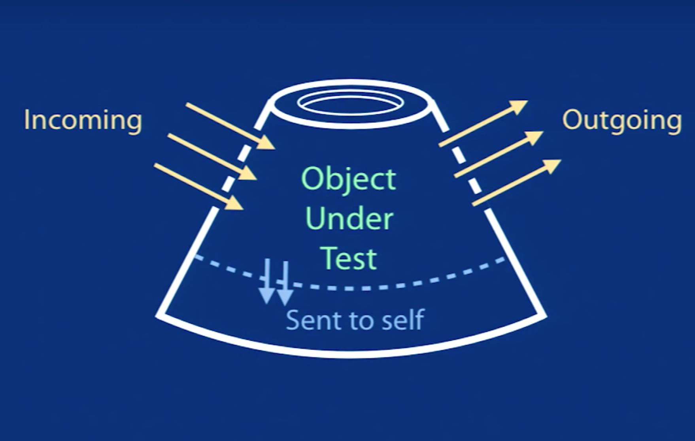
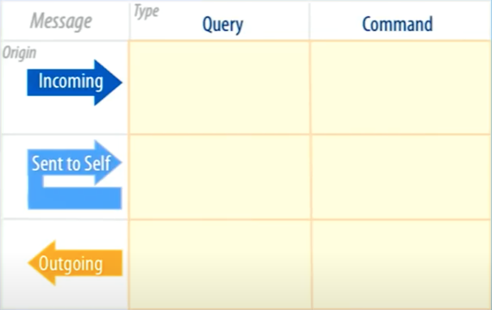
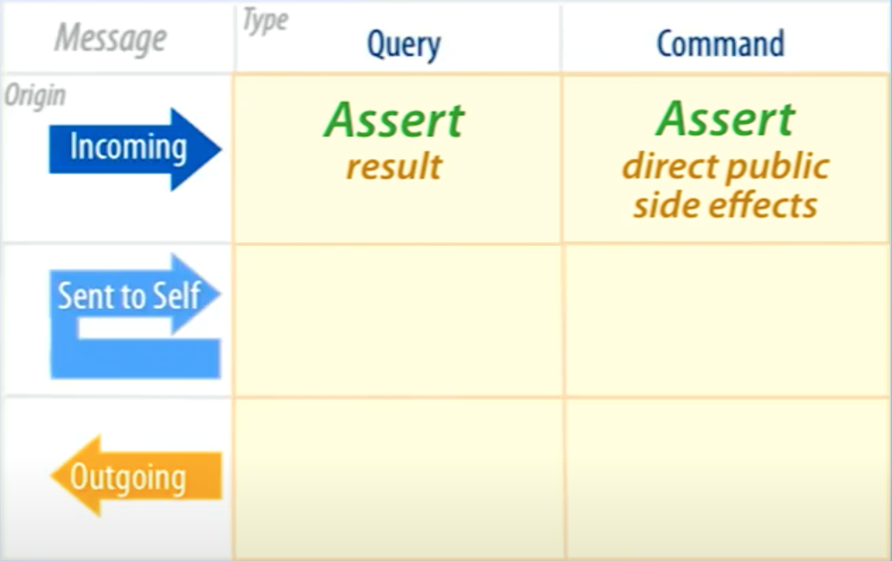

<style scoped>p { font-size: 0.5em }</style>

# Easy unit tests

Based upon the talk [The Magic Tricks of Testing](https://www.youtube.com/watch?v=URSWYvyc42M) by Sandi Metz.

Stephen Meriwether wrote about that exact talk in a [blog post](https://smeriwether.medium.com/the-magic-tricks-of-unit-testing-28ce0b300cee).

---

## Message passing in OOP

Object-oriented programming [..] is based on objects. Objects [..] **communicate with each other via messages**. [..] This is often called **method calling**.

---

## Message origins

- Incoming
- Outgoing
- Sent to self

---



---

## Types of messages

- **Query**: <br />Returns something, changes nothing.
- **Command**: <br />Returns nothing, changes something.

---



---

<!-- header: "Query incoming" -->

## Query incoming

---


---

```typescript
class Thing {
  public constructor(private foo: string = "") {}

  // --> Receives incoming queries
  public getFoo(): string {
    return this.foo;
  }

  public setFoo(foo: string): void {
    this.foo = foo;
  }
}
```

---

```typescript
describe("Thing", () => {
  const thing = new Thing();

  it("getFoo returns the correct value", () => {
    thing.setFoo("my-foo");

    // Assert what it sends back
    expect(thing.getFoo()).toBe("my-foo");
  });
});
```

---

## Rule 1

Test incoming query messages by making assertions about what they send back.

---


---

<!-- header: "Command incoming" -->

## Command incoming

---


---

```typescript
class Thing {
  public constructor(private foo: string = "") {}

  public getFoo(): string {
    return this.foo;
  }

  // --> Receives incoming command
  public setFoo(foo: string): void {
    this.foo = foo;
  }
}
```

---

```typescript
describe("Thing", () => {
  const thing = new Thing();

  it("setFoo sets the value", () => {
    thing.setFoo("my-foo");

    // Assert direct public side effects
    expect(thing.getFoo()).toBe("my-foo");
  });
});
```

---

## Rule 2

Test incoming command messages by making assertions about direct public side effects.

---



---

> [!IMPORTANT]
> Receiver of incoming message has sole responsibilty for asserting the result and direct public side effects.

---

<!-- header: "Query sent to self" -->

## Query sent to self

---


---

```typescript
class Thing {
  public constructor(private baz: string[] = []) {}

  // Receives incoming query AND
  // --> Sends query to self
  public getBazAsString(): string {
    return this.getBaz().join("");
  }

  // --> Receives sent-to-self query
  private getBaz(): string[] {
    return this.baz;
  }
}
```

---

```typescript
describe("Thing", () => {
  const thing = new Thing();

  // Enough to assert the result of getBazAsString,
  // DO NOT test getBaz directly

  it("getBazAsString returns the correct value", () => {
    // Assert return value
  });
});
```

---

> [!IMPORTANT]  
> Test the interface, not the implementation.

---

<!-- header: "Command sent to self" -->

## Command sent to self

---


---

```typescript
class Thing {
  public constructor(private baz: string[] = []) {}

  // Receives incoming command AND
  // --> Sends command to self
  public setBazFromString(baz: string): void {
    this.setBaz(baz.split(""));
  }

  // --> Receives sent-to-self command
  private setBaz(baz: string[]): void {
    this.baz = baz;
  }
}
```

---

```typescript
describe("Thing", () => {
  const thing = new Thing();

  // Enough to assert the direct public side effects
  // of setBazFromString,
  // DO NOT test setBaz directly

  it("setBazFromString sets the value", () => {
    // Assert direct public side effects
  });
});
```

---

<!-- header: "Query or command sent to self" -->

## Rule 3

Do not test private methods. Do not make assertions about their result. Do not expect to send them.

---


---

> [!IMPORTANT]
> Break rules if it saves money during development.

---

<!-- header: "Query outgoing" -->

## Query outgoing

---


---

```typescript
interface Dependency {
  getBar(): string;
  setBar(bar: string): void;
}

// Unit under test
class Thing {
  public constructor(private readonly dependency: Dependency) {}

  // Receives incoming query AND
  // --> Sends outgoing query
  public getDependencyBar(): string {
    return this.dependency.getBar();
  }
}
```

---

```typescript
describe("Thing", () => {
  const dependency = <Dependency>{
    getBar: () => "bar",
    setBar: (bar: string) => {},
  };

  const thing = new Thing(dependency);

  // Enough if dependency is tested,
  // DO NOT test the outgoing query directly.

  it("getDependencyBar returns the correct value", () => {
    // ...
  });
});

describe("Dependency", () => {
  it("getBar returns the correct value", () => {
    // Assert return value
  });
});
```

---

## Rule 4

Do not test outgoing query messages. Do not make assertions about their result. Do not expect to send them.

---


---

> [!IMPORTANT]
> If a message has no visible side effects, the sender should not test it.

---

<!-- header: "Command outgoing" -->

## Command outgoing

---


---

```typescript
interface Dependency {
  getBar(): string;
  setBar(bar: string): void;
}

// Unit under test
class Thing {
  public constructor(private readonly dependency: Dependency) {}

  // Receives incoming command AND
  // --> Sends outgoing command
  public setDependencyBar(bar: string): void {
    this.dependency.setBar(bar);
  }
}
```

---

```typescript
describe("Thing", () => {
  const setBarMock = mock((bar: string) => {});
  const dependency = <Dependency>{
    getBar: () => "bar",
    setBar: setBarMock,
  };

  const thing = new Thing(dependency);

  it("setDependencyBar sends the outgoing command", () => {
    thing.setDependencyBar("new bar");

    expect(setBarMock).toHaveBeenCalledWith("new bar");
  });

  // setDependencyBar has no DIRECT public side effects.
});

describe("Dependency", () => {
  it("setBar sets the value", () => {
    // Assert direct public side effects
  });
});
```

---

## Rule 5

Expect to send outgoing command messages.

---

## Rule 6

Honor the contract. Ensure test doubles stay in sync with the API.

---


---

<!-- header: "" -->

## Rules

---

1. Test incoming query messages by making assertions about what they send back.

---

2. Test incoming command messages by making assertions about direct public side effects.

---

3. Do not test private methods. Do not make assertions about their result. Do not expect to send them.

---

4. Do not test outgoing query messages. Do not make assertions about their result. Do not expect to send them.

---

5. Expect to send outgoing command messages.

---

6. Honor the contract. Ensure test doubles stay in sync with the API.

---

## Other take-aways

- Be a minimalist.
- Use good judgement.
- Test everything once.
- Test the interface.
- Trust collaborators.
- Insist on simplicity.
- Practice the tricks.

---
