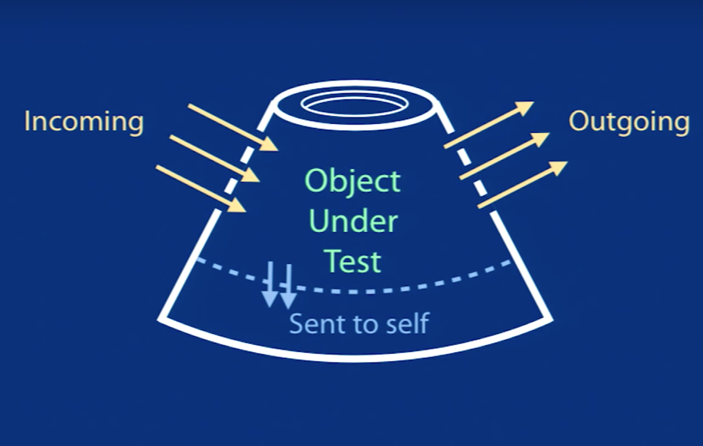
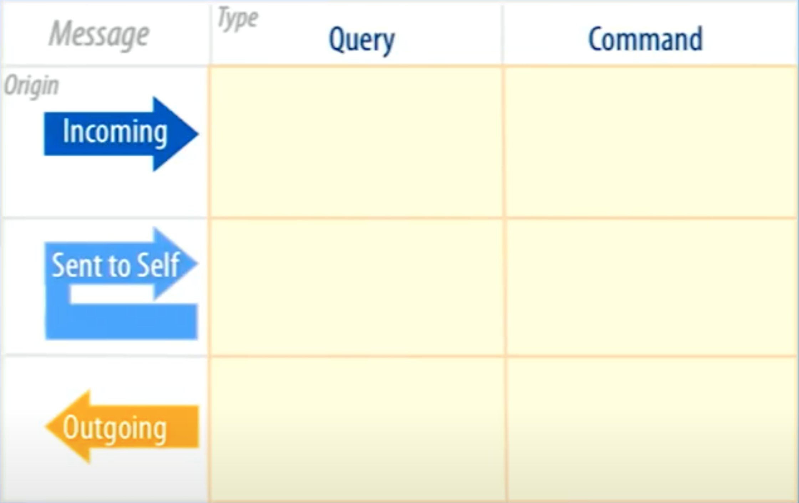
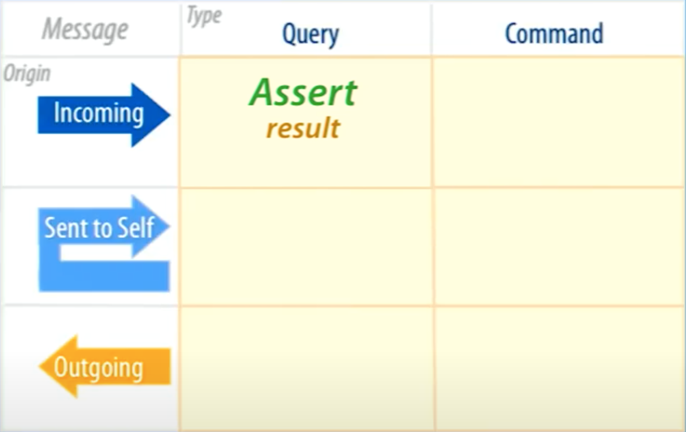
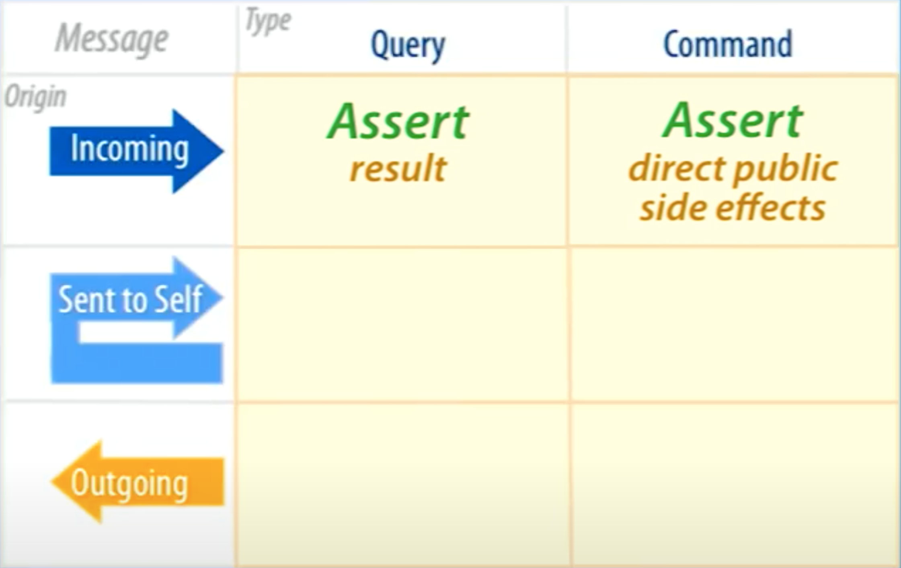
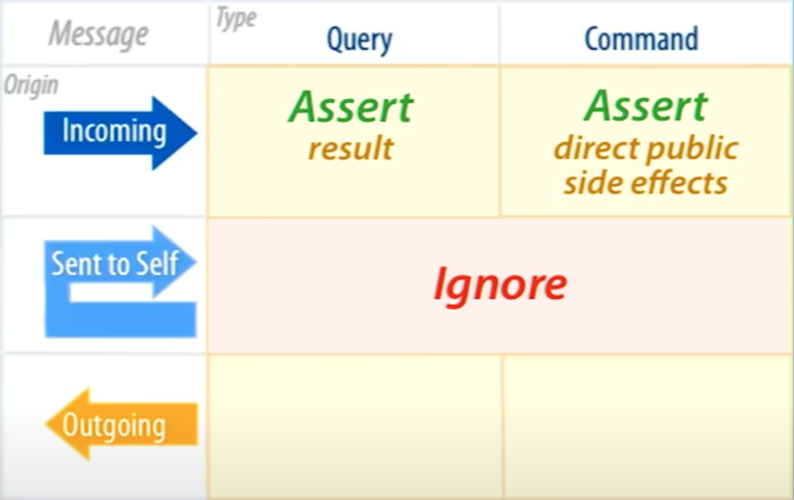
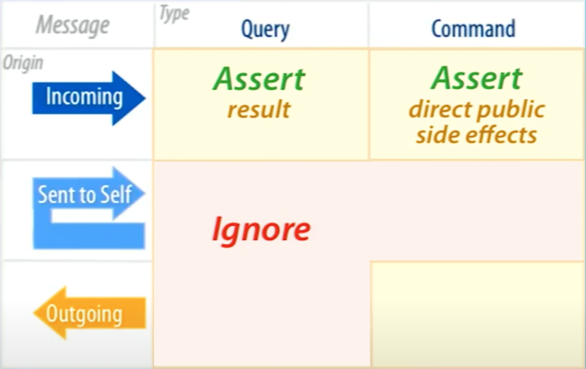
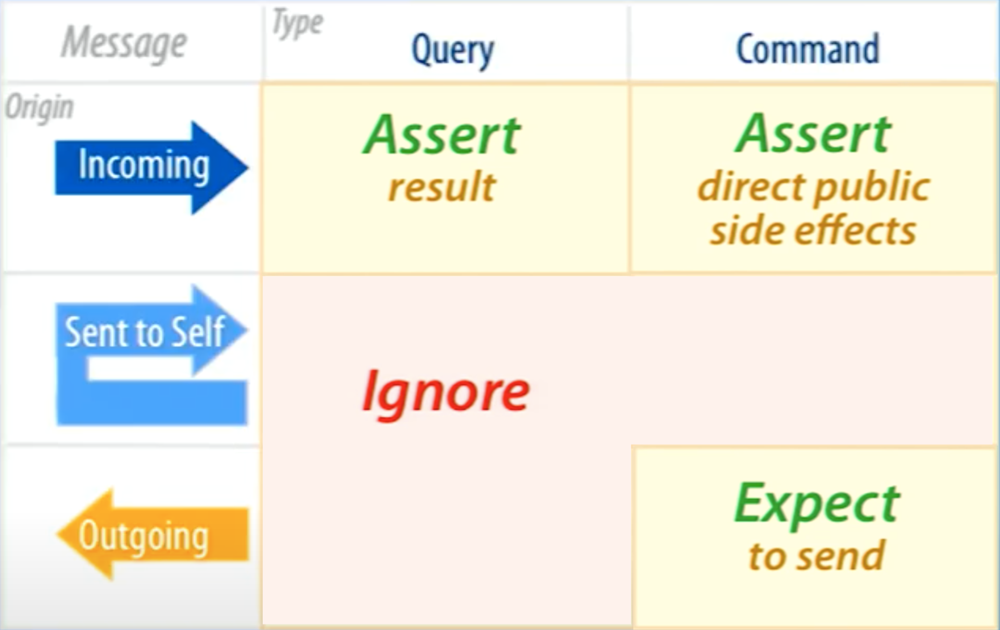

<style scoped>
h1 { font-size: 3.5em; }
p { font-size: 0.4em }
</style>

# Easy unit tests

Based upon the talk [The Magic Tricks of Testing](https://www.youtube.com/watch?v=URSWYvyc42M) ([slide deck](https://speakerdeck.com/spreeconf/the-magic-tricks-of-testing-sandi-metz)) by Sandi Metz .

Stephen Meriwether wrote about that exact talk in a [blog post](https://smeriwether.medium.com/the-magic-tricks-of-unit-testing-28ce0b300cee).

---

## Message passing in OOP

Object-oriented programming [..] is based on objects.

Objects [..] **communicate with each other via messages**. [..] This is often called **method calling**.

---

## Message origins

- Incoming
- Outgoing
- Sent to self

---



---

## Types of messages

- **Query**: <br />Returns something, changes nothing.
- **Command**: <br />Returns nothing, changes something ("side effect").

---



---

<!-- header: "Query incoming" -->

## Query incoming

!!!include(../diagrams/01-query-incoming.puml)!!!

---

```typescript
!!!include(../src/01-query-incoming.ts)!!!
```

---

```typescript
!!!include(../tests/01-query-incoming.test.ts)!!!
```

---

## Rule 1

Test incoming query messages by making assertions about what they send back.

---



---

<!-- header: "Command incoming" -->

## Command incoming

!!!include(../diagrams/02-command-incoming.puml)!!!

---

```typescript
!!!include(../src/02-command-incoming.ts)!!!
```

---

```typescript
!!!include(../tests/02-command-incoming.test.ts)!!!
```

---

## Rule 2

Test incoming command messages by making assertions about direct public side effects.

---



---

> Receiver of incoming message has sole responsibilty for asserting the result and direct public side effects.

---

<!-- header: "Query sent to self" -->

## Query sent to self

!!!include(../diagrams/03-query-sent-to-self.puml)!!!

---

```typescript
!!!include(../src/03-query-sent-to-self.ts)!!!
```

---

```typescript
!!!include(../tests/03-query-sent-to-self.test.ts)!!!
```

---

> Test the interface, not the implementation.

---

<!-- header: "Command sent to self" -->

## Command sent to self

!!!include(../diagrams/04-command-sent-to-self.puml)!!!

---

```typescript
!!!include(../src/04-command-sent-to-self.ts)!!!
```

---

```typescript
!!!include(../tests/04-command-sent-to-self.test.ts)!!!
```

---

<!-- header: "Query or command sent to self" -->

## Rule 3

Do not test private methods. Do not make assertions about their result. Do not expect to send them.

---



---

> Break rules if it saves money during development.

---

<!-- header: "Query outgoing" -->

## Query outgoing

!!!include(../diagrams/05-query-outgoing.puml)!!!

---

```typescript
!!!include(../src/05-query-outgoing.ts)!!!
```

---

```typescript
!!!include(../tests/05-query-outgoing.test.ts)!!!
```

---

## Rule 4

Do not test outgoing query messages. Do not make assertions about their result. Do not expect to send them.

---



---

> If a message has no visible side effects, the sender should not test it.

---

<!-- header: "Command outgoing" -->

## Command outgoing

!!!include(../diagrams/06-command-outgoing.puml)!!!

---

```typescript
!!!include(../src/06-command-outgoing.ts)!!!
```

---

```typescript
!!!include(../tests/06-command-outgoing.test.ts)!!!
```

---

## Rule 5

Expect to send outgoing command messages.

---

## Rule 6

Honor the contract. Ensure test doubles stay in sync with the API.

---



---

<!-- header: "" -->

## Rules

---

1. Test incoming query messages by making assertions about what they send back.

---

2. Test incoming command messages by making assertions about direct public side effects.

---

3. Do not test private methods. Do not make assertions about their result. Do not expect to send them.

---

4. Do not test outgoing query messages. Do not make assertions about their result. Do not expect to send them.

---

5. Expect to send outgoing command messages.

---

6. Honor the contract. Ensure test doubles stay in sync with the API.

---


---


Given this know-how about testing objects, how would you test a component, a module, the whole system?

---

https://github.com/skiffek/easy-unit-tests
